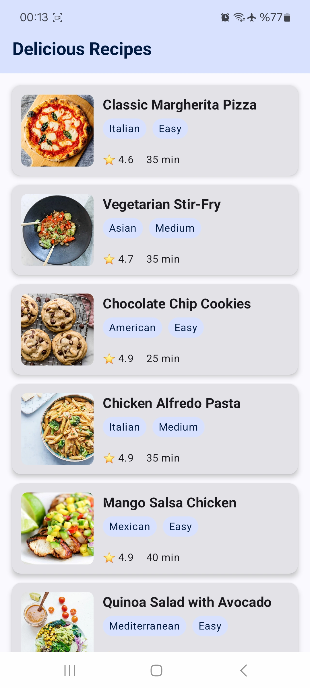
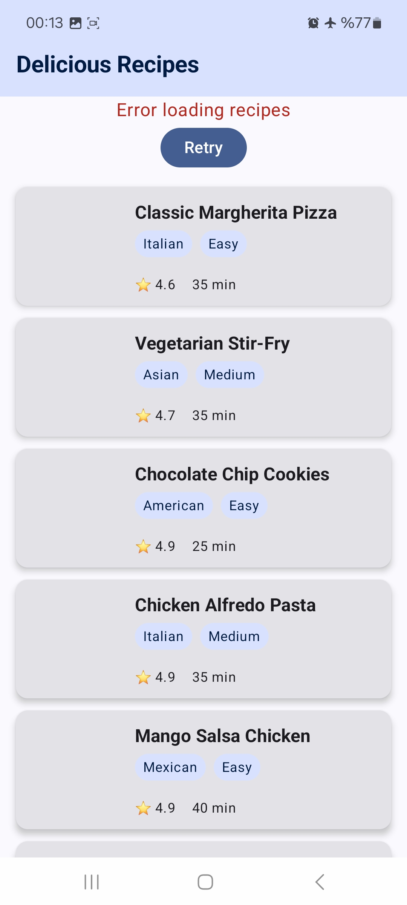

# Recipe Pagination App

A modern Android application that demonstrates **Paging 3** implementation with **RemoteMediator** for efficient data loading and caching. Built with **Jetpack Compose**, **Room Database**, and following **Clean Architecture** principles.

## 🔑 Key Features

### Core Functionality
- **Infinite Scrolling**: Seamless pagination with Jetpack Paging 3
- **Offline-First Architecture**: Data cached locally using Room Database
- **RemoteMediator**: Smart data loading from network with local caching
- **Clean Architecture**: Well-structured codebase with separation of concerns
- **Modern UI**: Beautiful interface built with Jetpack Compose

### Technical Highlights
- **Paging 3 Integration**: Efficient handling of large datasets
- **Room Database**: Local data persistence with TypeConverters
- **Retrofit Integration**: RESTful API communication
- **Dependency Injection**: Hilt for clean dependency management
- **Error Handling**: Comprehensive error states and retry mechanisms
- **Loading States**: Smooth loading indicators and pagination states

## 🛠️ Technology Stack

### Architecture & Patterns
- **Clean Architecture**: Domain, Data, and Presentation layers
- **MVI Pattern**: ViewModel with StateFlow for state management
- **Repository Pattern**: Centralized data management
- **RemoteMediator Pattern**: Offline-first data loading strategy

### Libraries & Framework
| Library | Version | Purpose |
|---------|---------|---------|
| **Jetpack Compose** | BOM 2025.05.01 | Modern UI toolkit |
| **Paging 3** | 3.3.6 | Pagination and data loading |
| **Room** | 2.7.1 | Local database |
| **Hilt** | 2.55 | Dependency injection |
| **Retrofit** | 2.9.0 | Network requests |
| **Coil** | 2.4.0 | Image loading |
| **OkHttp** | 4.11.0 | HTTP client with logging |
| **Coroutines** | 1.10.2 | Asynchronous programming |
| **Material 3** | Latest | UI components |
| **Gson** | Latest | JSON serialization |

## 📁 Project Structure

```
app/src/main/java/com/example/pagination/
├── core/
│   └── constants/         # App constants
├── data/
│   ├── local/
│   │   ├── dao/          # Room DAOs
│   │   ├── database/     # Database setup
│   │   └── entities/     # Room entities
│   ├── mapper/           # Data mapping functions
│   ├── mediator/         # RemoteMediator implementation
│   ├── remote/
│   │   ├── api/          # Retrofit API interfaces
│   │   └── dto/          # Network DTOs
│   └── repository/       # Repository implementations
├── di/                   # Dependency injection modules
├── domain/
│   ├── model/           # Domain models
│   └── repository/      # Repository interfaces
└── presentation/
    ├── recipe/          # Recipe screen and ViewModels
    ├── ui/theme/        # App theming
    └── MainActivity.kt  # Main activity
```

## 🏗️ Architecture Overview

### Paging 3 with RemoteMediator
The app implements **RemoteMediator** pattern for optimal data loading:

1. **Local First**: Always load data from Room Database
2. **Network Fallback**: Fetch from API when local data is insufficient
3. **Smart Caching**: Cache network responses locally
4. **Offline Support**: Works seamlessly without internet connection

### Data Flow
```
API → RemoteMediator → Room Database → Repository → ViewModel → UI
```

### Key Components

#### RemoteMediator
- Handles network requests and local caching
- Manages pagination keys for efficient loading
- Provides offline-first experience

#### Repository Pattern
- Single source of truth for data access
- Abstracts data sources from ViewModels
- Combines local and remote data seamlessly

#### Clean Architecture Layers
- **Presentation**: Compose UI and ViewModels
- **Domain**: Business logic and models
- **Data**: Repository implementations and data sources

## 📱 Screenshots & Demo

### App Screenshots
<table>
  <tr>
    <th>Recipe List</th>
    <th>Recipe List (Without Internet)</th>
  </tr>
  <tr>
    <td></td>
    <td></td>
  </tr>
</table>

### Demo Video
You can watch the demo video on YouTube:

[📽️ paginationDemoVideo.mp4](https://youtube.com/shorts/gjtW7ROFDaU?si=OmrKdrz1pKMTrFkH)

### API Configuration
The app uses [DummyJSON API](https://dummyjson.com/) for recipe data. No API key required - just build and run!

## 🔧 Implementation Details

### Paging Configuration
```kotlin
PagingConfig(
    pageSize = 20,           // Items per page
    prefetchDistance = 5,    // Load new page when 5 items remain
    enablePlaceholders = false,
    initialLoadSize = 20     // Initial load size
)
```

### RemoteMediator Flow
1. **Initialize**: Determine refresh strategy
2. **Load**: Handle different load types (REFRESH, PREPEND, APPEND)
3. **Network**: Fetch data from API
4. **Cache**: Store in Room Database with pagination keys
5. **Return**: Success or error state

### Error Handling
- Network connectivity issues
- API response errors  
- Database operation failures
- User-friendly error messages with retry options

---

⭐ If you found this project helpful, please give it a star!
